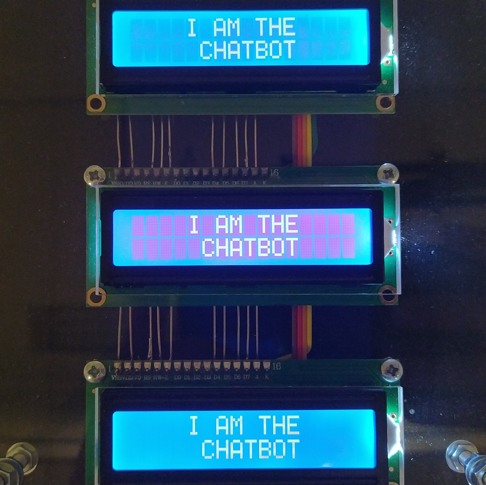
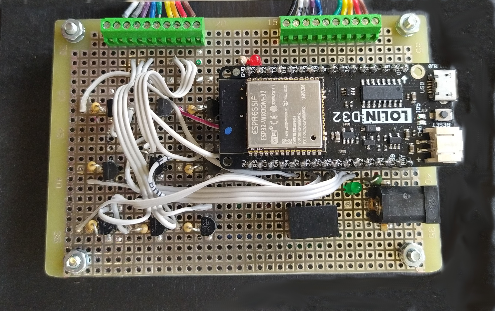

## ESP32 NextCloud chatbot 
Using MicroPython on an ESP32, the included code manages a network connection with a remote NextCloud server. The device signs in as a predefined user in order to send and receive messages in a dedicated chatroom. The application which manages the chat session is Nextcloud Talk. Any new message received in the chatroom will be analyzed, processed and displayed an LCD1602 display. For creativity purposes, I added 9 of these displays. The same message is shown on all of them. The backlight on each display however is individually activated by different pins on the ESP32. An animation code is included to illustrate multiple sequences that were prepared. This done electronically by sending PWM signals to a network of a BC337 transistors, one for each screeen. 



### Hardware Used
- LOLIN D32 V1.0.0 (ESP32)
- LCD1602
- BC337 Transistors



### Custom modules and their source links
- [LCD](https://github.com/rdagger/micropython-charlcd)
- [uping](https://gist.github.com/shawwwn/91cc8979e33e82af6d99ec34c38195fb)

### Notes on some of the internal modules used
- urequest module is used to manage communication with the NextCloud Talk API
- ubinascii module is required for managing encryption of username and password

The following curl commands are useful for initial testing of the chat server. Open a Linux terminal and follow the given instruction to make sure we have basic send and receive working.

```bash
#------------------- get last message in chat feed ----------------------
#change username and password. Replace URL with your domain name. Replace the xxxxxxxx with your room token.

curl -k -s -u "username:password" -H "OCS-APIRequest: true" -X GET "https://yourDomainName.ddns.net/ocs/v1.php/apps/spreed/api/v1/chat/xxxxxxxx?lookIntoFuture=0&limit=1&setReadMarker=1" | grep "<message>" | sed -r "s|<?/message>||g" | tail -1

#-------------------- post a message in chat feed -----------------------
#Change chatRoom name for the name of your chat room. Chage someOtherUser to the name of a user to whom you wish to address the message. Change username and password. Replace URL with your domain name. Replace the xxxxxxxx with your room token.
curl -d '{"chatRoom": "chatRoom", "message": "Hello World @someOtherUser"}' -H "Content-Type: application/json" -H "Accept: application/json" -H "OCS-APIRequest: true" -u "username:password" https://yourDomainName.ddns.net/ocs/v1.php/apps/spreed/api/v1/chat/xxxxxxxx
```

### References:
- [NextCloud Talk API](https://nextcloud-talk.readthedocs.io/en/latest/chat/)
